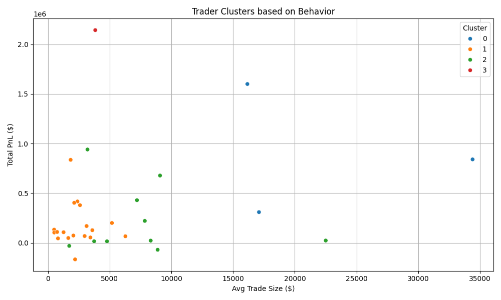

````markdown
# 📊 Trader Sentiment Analysis with KMeans Clustering

This project explores the relationship between **Bitcoin market sentiment** (Fear & Greed Index) and **individual trader performance**, using historical trading data from Hyperliquid. It uncovers hidden behavioral patterns and groups traders based on their trading behavior under various market conditions using **KMeans clustering**.

---

## 🔍 Objective

> "Can we use market sentiment to predict or understand trader behavior?"

We aim to:
- Analyze how market sentiment impacts trading performance
- Cluster traders by behavior (e.g., risk-takers, scalpers)
- Derive insights for smarter, sentiment-aware trading strategies

---

## 📁 Data Used

1. **Bitcoin Fear & Greed Index** (`fear_greed_index.csv`)
   - Columns: `date`, `value`, `classification` (e.g., Greed, Fear)

2. **Hyperliquid Historical Trade Data** (`historical_data.csv`)
   - Columns: `Account`, `Execution Price`, `Size USD`, `Side`, `Timestamp IST`, `Closed PnL`, `Leverage`, etc.

---

## 🧠 Key Features

- 📊 Summary statistics by sentiment
- 📦 Boxplot of PnL by market sentiment
- 📈 Correlation analysis between sentiment and trader PnL
- 📉 Time series plot of PnL vs. Fear-Greed index
- 👤 Trader clustering using **KMeans** on:
  - Total PnL
  - Average Trade Size
  - Average Sentiment Exposure
  - Active Trading Days

---

## 📸 Visualizations

- Distribution of PnL across sentiments  
- Total trading volume during sentiment phases  
- Sentiment-PnL scatter + regression  
- Daily sentiment & PnL trend lines  
- Trader clusters colored by behavior  

---

##Screenshots :

### 📦 PnL Distribution by Market Sentiment


### 📊 Total Trade Volume by Sentiment


### 📈 Sentiment Index vs Closed PnL


### 📉 Daily Total PnL vs Sentiment Index


### 👤 KMeans Trader Clusters


## ⚙️ How to Run

### 1. Clone the repository
```bash
git clone https://github.com/AyaanShaheer/trader-sentiment-analysis.git
cd trader-sentiment-analysis
````

### 2. Set up a virtual environment (optional but recommended)

```bash
python -m venv venv
source venv/bin/activate  # on Windows: venv\Scripts\activate
```

### 3. Install dependencies

```bash
pip install -r requirements.txt
```

### 4. Run the analysis

```bash
python main.py
```

---

## 🗂 Folder Structure

```
trader-sentiment-analysis/
├── main.py                # Core script with all analysis and plots
├── fear_greed_index.csv   # Bitcoin market sentiment dataset
├── historical_data.csv    # Trader execution-level data
├── requirements.txt       # Python dependencies
├── .gitignore             # To ignore venv, cache, etc.
└── README.md              # This file
```

---

## 📈 Example Insights

* Traders perform better on average during **Greed phases**, but total volume surges in **Fear**.
* Some traders are **sentiment-agnostic**, while others only thrive during emotional extremes.
* KMeans clusters reveal distinct groups:

  * ⚡ High-risk, high-volume traders
  * 🧠 Consistent, sentiment-neutral traders
  * 💼 Low-activity, low-risk traders
  * 🚀 Greed-driven momentum chasers

---

## ✨ Future Improvements

* Use **PCA** or **t-SNE** to visualize clusters in 3D
* Include **trade frequency** and **leverage** in clustering
* Build a **streamlit app** to explore clusters interactively

---

## 📬 Contact

For questions, feedback, or collaborations:

**Author**: \[Ayaan Shaheer]
**Email**: [MailID](gfever252@gmail.com)
**GitHub**: [AyaanShaheer](https://github.com/AyaanShaheer)
**Portfolio**: [Portfolio Website](https://chatprofolio.vercel.app/profile/ayaanshaheer)

---

> “Data beats opinion — especially when sentiment speaks louder than logic.”

```

---
